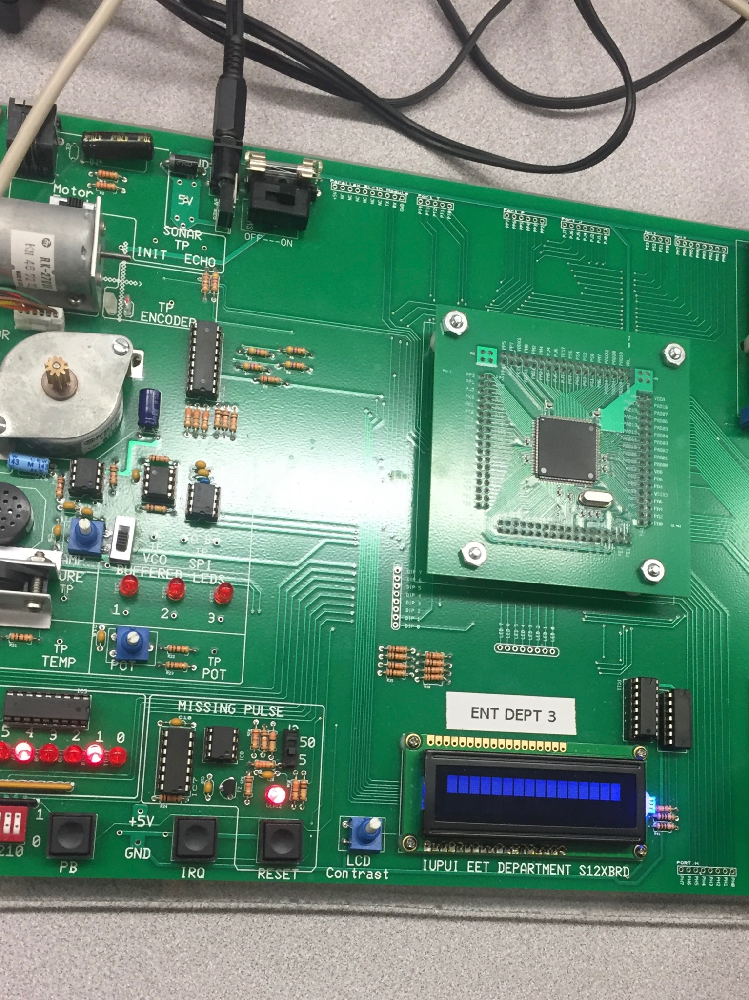

# SonarRangeFinder
This is code used to program a MC9S12XEP100 to create a Sonar Range Finder. This range finder uses sound to find the range, in feet, between a sonic transmitter and an object at the push of a button. The distance is displayed on an LCD screen. 

### Hardware 

**NXP MC9S12XEP100 Dev Kit** - This dev kit includes the MC9S12XEP100 Micro-Controller, LCD screen, and buttons on a single board

**Sonar Transmitter/Receiver Module** - Connects to the Dev kit via RJ11 connection. Transmits and receives sound pulses.

